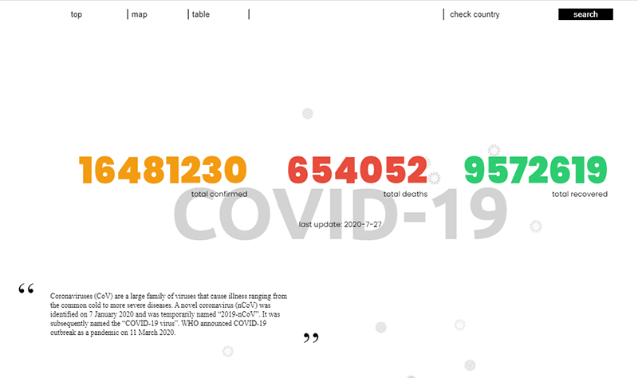
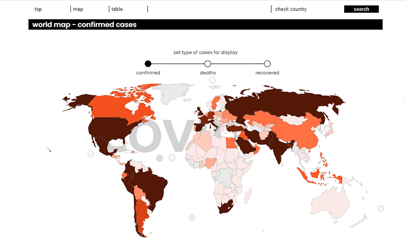
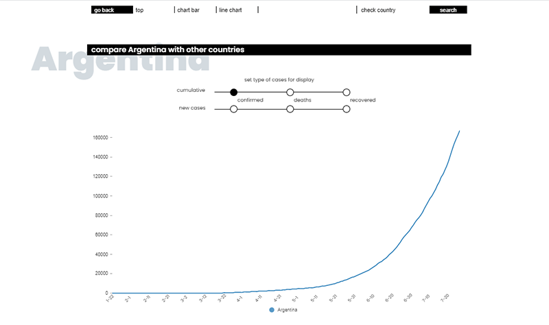
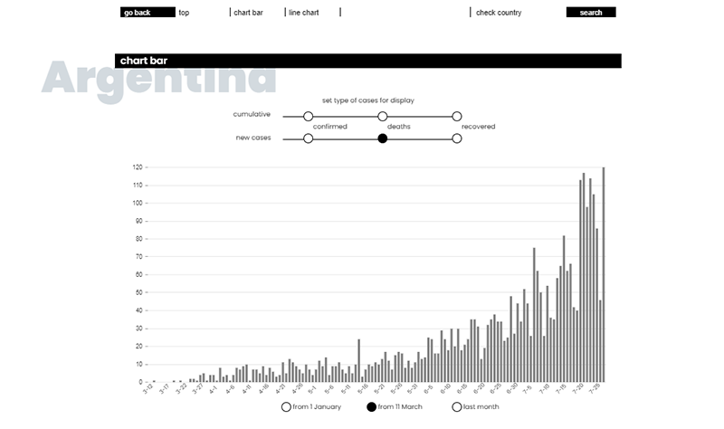

# covid-19

> This app show statistics related with COVID-19. There are two pages: 
- `global page` - where you can find and compare data for whole world. Scroll down (or click navigation button) for map chart and table. Click on the map, or write country name inside input to go to the country page.
- `country page` - here you have statistics for selected country. Data are presented on chartbar and linechart. click buttons to change data as below: 
--`confirmed` (all confirmed cases found from beggining) 
--`deaths` (all deaths cases found from beggining) 
--`recovered` (all recovered cases found from beggining) 
--`new confirmed` (new confirmed cases for a day) 
--`new deaths` (new deaths cases for a day)
--`new recovered` (new recovered cases for a day) 
On line chart you can also choose another country to compare. 

### [Live Demo](https://unpolaco.github.io/covid-19/)

## Screenshots

## API

All COVID data based on [Covid19 GraphQL API](https://github.com/rlindskog/covid19-graphql)

## Animation

Animations based on [GSAP library](https://www.npmjs.com/package/react-gsap)

## Styling

This project uses [saas](https://www.npmjs.com/package/sass) and [node-saas](https://www.npmjs.com/package/node-sass) and css modules to handle styling: `src/global_styles/global.scss` defines the styling base for multiple components and `src/global_styles/variables.scss` define css variables for project.

## Technologies

- `react`: version 16.13.1
- `react-apollo`: version 3.1.5
- `react-gsap`: version 2.2.1
- `react-router-dom`: version 5.2.0
- `react-scripts`: version 3.4.1
- `typescript`: version 3.2.1
- `nivo`: version 0.31.0
- `graphql`: version 15.0.0
- `saas`: version 1.3.0
- `node-sass`: version 4.14.1
- `apollo-client`: version 2.6.8
- `moment`: version 2.25.3

## Installation

- Clone the repo in your terminal by clicking the _green_ clone or download button at the top right and copyin the url
- In your terminal, type `git clone URL`
  - replace URL with the url you copied
  - hit enter
- This will copy all the files from this repo down to your computer
- In your terminal, cd into the directory you just created
- Type `npm install` to install all dependencies
- Last, but not least, type `npm start` to run the app locally.
- To look at the code, just open up the project in your favorite code editor!a
